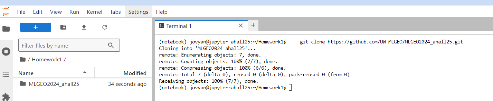
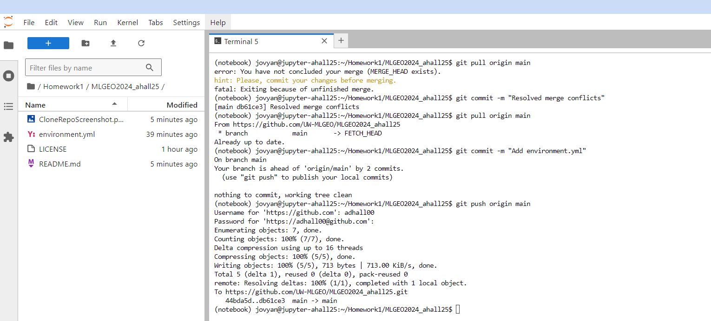

# Anna Hall's Repository for ESS569

This repository will house all of the code and data used for an introductory machine learning in geosciences class. The link to the repository can be found here: [Github](https://github.com/UW-MLGEO/MLGEO2024_ahall25)

### To install this repository:
1. Navigate to your directory of choice either directly in the JupyterHub interface or in your own terminal.
2. Paste the following script into the terminal and hit **enter**.
```bash
    git clone https://github.com/UW-MLGEO/MLGEO2024_ahall25.git
```
### 
When you clone the reopository, the command line output should look like the following screenshot. The repository will appear in the directory on the left hand side in the navigator sidebar.
  
  

Now using the git commands is a bit tricky, follow the steps below for getting the environment.yml file from the JupyterHub interface to github.
1. Navigate to the directory that now houses the repo and move the environment.yml file to this directory.
2. Open a terminal shell in this directory and copy the following code
    ```bash
    git commit -m "Add environment.yml"
    ```
3. Now push the .yml file to github by copying the following code
   ```bash
    git push origin main
    ```
Note: The screenshot shows what to do if things get hairy.

    

Note: You may need to generate a personal toaken, this can be done by navigating to the settings tab on github, then to developer settings (last option on the sidebar), and finally generate a token (you need to check the repo checkbox if you are generating one to be used within JupyterHub)
